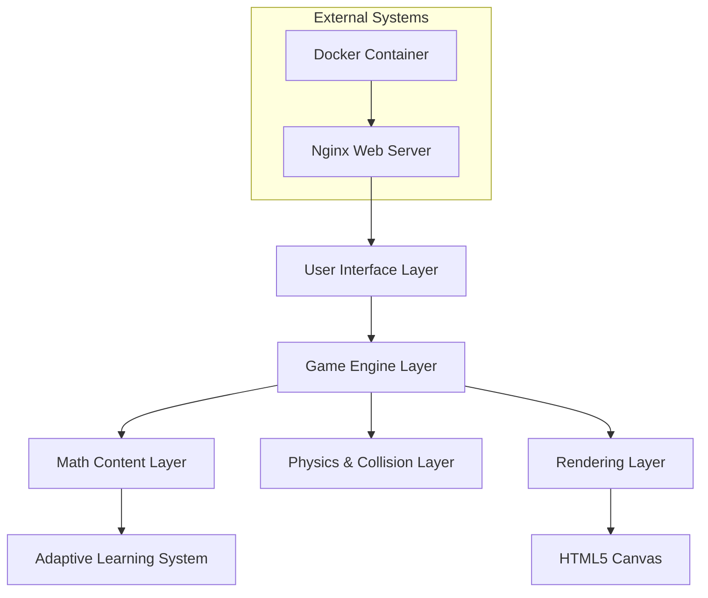

# Design Document

## Overview

Quick Math is a browser-based educational game that combines arcade-style gameplay with mathematical learning. The game uses HTML5 Canvas for rendering, JavaScript for game logic, and a modular architecture that supports easy extension of math operations and difficulty levels. Players control a character that moves around the screen to collide with correct answers to math problems, creating an engaging learning experience through movement and immediate feedback.

The technical architecture follows a component-based design pattern with clear separation between the game engine, educational content, and user interface systems. This approach ensures maintainability and allows for future expansion of mathematical concepts and gameplay mechanics.

## Architecture

### High-Level Architecture

The system follows a layered architecture with the following main components:



### Core Architecture Patterns

**Module Pattern**: Each major system (GameEngine, MathGenerator, CollisionDetector, etc.) is implemented as a self-contained module with private state and public interfaces.

**Entity-Component System**: Game objects (Player, NumberTiles) are composed of components (Position, Velocity, Renderer, Collider) for flexibility and reusability.

**Observer Pattern**: The game uses event-driven communication between systems to maintain loose coupling between components.

**State Machine**: Game states (Menu, Playing, GameOver, LevelComplete) are managed through a finite state machine for clear flow control.

## Components and Interfaces

### GameEngine

The central orchestrator that manages the game loop, state transitions, and system coordination.

```javascript
class GameEngine {
    constructor(canvasId, config)
    
    // Core game loop methods
    start()
    update(deltaTime)
    render()
    pause()
    resume()
    
    // State management
    setState(newState)
    getCurrentState()
    
    // System registration
    registerSystem(system)
    getSystem(systemType)
}
```

**Responsibilities:**
- Manages the main game loop (60 FPS target)
- Coordinates between all game systems
- Handles state transitions and game flow
- Provides centralized configuration management

### MathContentSystem

Generates mathematical problems and manages educational content progression.

```javascript
class MathContentSystem {
    constructor(difficultyConfig)
    
    // Problem generation
    generateProblem(operation, difficulty)
    generateAnswerOptions(correctAnswer, count)
    
    // Difficulty management
    adjustDifficulty(playerPerformance)
    getCurrentDifficulty()
    
    // Operation support
    supportedOperations: ['addition', 'subtraction', 'multiplication', 'division']
}
```

**Problem Generation Algorithm:**
- Uses configurable ranges for operands based on difficulty level
- Ensures answer options are plausible but distinct
- Balances correct answer placement to avoid patterns
- Tracks operation-specific performance for targeted practice

### PhysicsSystem

Handles object movement, collision detection, and spatial relationships.

```javascript
class PhysicsSystem {
    constructor(worldBounds)
    
    // Movement and physics
    updatePositions(entities, deltaTime)
    applyVelocity(entity, deltaTime)
    
    // Collision detection
    checkCollisions(player, numberTiles)
    detectCollision(entityA, entityB)
    
    // Spatial optimization
    spatialHash: SpatialHashGrid
}
```

**Collision Detection Implementation:**
- Uses axis-aligned bounding box (AABB) collision detection for performance
- Implements spatial hashing for efficient collision queries with multiple moving objects
- Supports both rectangular and circular collision shapes
- Provides collision response callbacks for game logic integration

### RenderingSystem

Manages all visual output using HTML5 Canvas with optimized drawing operations.

```javascript
class RenderingSystem {
    constructor(canvas, context)
    
    // Core rendering
    clear()
    render(entities)
    renderUI(gameState)
    
    // Visual effects
    renderParticleEffect(effect)
    renderAnimation(animation)
    
    // Performance optimization
    enableDirtyRectangles: boolean
    renderLayers: Map<string, Layer>
}
```

**Rendering Optimizations:**
- Uses dirty rectangle rendering to minimize canvas redraws
- Implements object pooling for frequently created/destroyed visual elements
- Separates static UI elements from dynamic game objects for efficient layering
- Supports smooth interpolation for movement animations

### InputSystem

Handles both keyboard and touch input with unified event processing.

```javascript
class InputSystem {
    constructor(canvas)
    
    // Input handling
    getInputState()
    isKeyPressed(key)
    getTouchPosition()
    
    // Event management
    addEventListener(eventType, callback)
    removeEventListener(eventType, callback)
    
    // Input mapping
    keyBindings: Map<string, string>
    touchGestures: GestureRecognizer
}
```

**Input Processing:**
- Normalizes keyboard and touch input into consistent movement commands
- Supports configurable key bindings for accessibility
- Implements touch gesture recognition for mobile devices
- Provides input buffering to handle rapid input sequences

### AdaptiveLearningSystem

Analyzes player performance and adjusts difficulty dynamically.

```javascript
class AdaptiveLearningSystem {
    constructor(learningConfig)
    
    // Performance tracking
    recordAnswer(operation, difficulty, isCorrect, responseTime)
    getPerformanceMetrics(operation)
    
    // Difficulty adjustment
    calculateOptimalDifficulty(operation)
    shouldIncreaseLevel()
    
    // Learning analytics
    performanceHistory: PerformanceTracker
    adaptationRules: DifficultyRules
}
```

**Adaptive Algorithm:**
- Tracks accuracy and response time per operation type
- Uses sliding window analysis to detect performance trends
- Implements spaced repetition for operations where player struggles
- Balances challenge level to maintain engagement without frustration

## Data Models

### GameState

```javascript
class GameState {
    currentLevel: number
    score: number
    health: number
    maxHealth: number
    currentProblem: MathProblem
    gameMode: string // 'menu', 'playing', 'paused', 'gameOver'
    timeElapsed: number
    streakCount: number
}
```

### MathProblem

```javascript
class MathProblem {
    operation: string // 'addition', 'subtraction', 'multiplication', 'division'
    operandA: number
    operandB: number
    correctAnswer: number
    answerOptions: number[]
    difficulty: number
    timeCreated: timestamp
}
```

### Entity (Player and NumberTiles)

```javascript
class Entity {
    id: string
    position: Vector2D
    velocity: Vector2D
    size: Vector2D
    rotation: number
    components: Map<string, Component>
    
    // Component management
    addComponent(component)
    getComponent(type)
    removeComponent(type)
}
```

### PlayerCharacter extends Entity

```javascript
class PlayerCharacter extends Entity {
    movementSpeed: number
    inputBuffer: InputCommand[]
    animationState: string
    
    // Movement methods
    moveToward(targetPosition)
    setVelocity(velocity)
    applyInput(inputState)
}
```

### NumberTile extends Entity

```javascript
class NumberTile extends Entity {
    value: number
    isCorrectAnswer: boolean
    movementPattern: MovementPattern
    visualStyle: TileStyle
    
    // Behavior methods
    updateMovement(deltaTime)
    onCollision(otherEntity)
    setHighlight(isHighlighted)
}
```

### PerformanceMetrics

```javascript
class PerformanceMetrics {
    operation: string
    totalAttempts: number
    correctAnswers: number
    averageResponseTime: number
    recentAccuracy: number // Last 10 attempts
    difficultyProgression: number[]
    lastUpdated: timestamp
}
```

## Correctness Properties

*A property is a characteristic or behavior that should hold true across all valid executions of a system—essentially, a formal statement about what the system should do. Properties serve as the bridge between human-readable specifications and machine-verifiable correctness guarantees.*

### Property Reflection

After analyzing all acceptance criteria, several properties can be consolidated to eliminate redundancy:

- Math problem generation properties (5.1-5.4) can be combined into a single comprehensive property about problem generation across all operations
- Visual feedback properties (2.2, 2.4) can be combined into one property about collision feedback
- Performance tracking and adaptive difficulty properties (7.1-7.4) can be consolidated into properties about adaptive learning behavior
- Movement and animation properties (1.5, 6.3) address different aspects and should remain separate

### Correctness Properties

Property 1: Number tile movement diversity
*For any* game session, the spawned number tiles should have varying speeds and follow different movement patterns to create dynamic gameplay
**Validates: Requirements 1.5**

Property 2: Input responsiveness
*For any* valid input event (keyboard or touch), the player character should move appropriately in response to that input
**Validates: Requirements 1.3**

Property 3: Collision detection accuracy
*For any* collision between the player character and a number tile, the collision detector should correctly determine whether the tile's value matches the current question's answer
**Validates: Requirements 1.4**

Property 4: Score increment on correct answers
*For any* correct collision, the score system should increase the player's score by the appropriate amount
**Validates: Requirements 2.1**

Property 5: Health decrement on incorrect answers
*For any* incorrect collision, the health system should decrease the player's health by the appropriate amount
**Validates: Requirements 2.3**

Property 6: Collision feedback consistency
*For any* collision (correct or incorrect), the game engine should provide appropriate visual feedback that matches the collision type
**Validates: Requirements 2.2, 2.4**

Property 7: Question progression
*For any* correctly answered question, the game engine should immediately generate and display a new question
**Validates: Requirements 2.5**

Property 8: Health bar visual updates
*For any* change in player health, the health bar display should visually reflect the current health value
**Validates: Requirements 3.2**

Property 9: Level difficulty progression
*For any* level advancement, the difficulty should increase through faster tile movement, more answer options, or mixed operations
**Validates: Requirements 4.1, 4.2, 4.3, 4.4**

Property 10: Math problem generation scaling
*For any* difficulty level and operation type (addition, subtraction, multiplication, division), generated problems should have appropriate complexity for that difficulty level
**Validates: Requirements 5.1, 5.2, 5.3, 5.4**

Property 11: Operation mixing in advanced levels
*For any* advanced level, the game should present problems using multiple different mathematical operations
**Validates: Requirements 5.5**

Property 12: Animation smoothness
*For any* moving element in the game, position updates should occur smoothly over time without jarring jumps
**Validates: Requirements 6.3**

Property 13: Responsive interface scaling
*For any* screen size within the supported range, the game interface should scale appropriately and remain functional
**Validates: Requirements 6.5**

Property 14: Adaptive difficulty adjustment
*For any* consistent pattern of correct answers, the system should increase question difficulty appropriately
**Validates: Requirements 7.1**

Property 15: Targeted practice for struggling areas
*For any* operation type where the player shows poor performance, the system should provide additional practice problems of that type
**Validates: Requirements 7.2**

Property 16: Performance metrics tracking
*For any* answered question, the system should record performance data and use it to inform future difficulty adjustments
**Validates: Requirements 7.3, 7.4**

Property 17: Frame rate maintenance
*For any* gameplay scenario with multiple moving elements, the game should maintain smooth frame rates above the minimum threshold
**Validates: Requirements 8.2**

Property 18: Collision detection responsiveness
*For any* collision scenario, the collision detection should respond accurately and immediately without delay
**Validates: Requirements 8.3**

## Error Handling

### Input Validation
- **Invalid Math Operations**: The system validates that all generated math problems have valid operands and results within acceptable ranges
- **Boundary Conditions**: Movement is constrained within screen boundaries with appropriate collision responses
- **Input Sanitization**: All user inputs are validated to prevent invalid game states

### Performance Degradation
- **Frame Rate Monitoring**: The system monitors frame rates and reduces visual complexity if performance drops below thresholds
- **Memory Management**: Object pooling prevents memory leaks from frequently created/destroyed game objects
- **Collision Optimization**: Spatial hashing reduces collision detection complexity when many objects are present

### Browser Compatibility
- **Feature Detection**: The system checks for required HTML5 Canvas and JavaScript features before initialization
- **Graceful Degradation**: Fallback behaviors are provided for browsers with limited capabilities
- **Error Recovery**: The game can recover from rendering errors and continue operation

### Network and Loading
- **Asset Loading Failures**: The system provides fallback assets and error messages for failed resource loads
- **Container Startup Issues**: Docker configuration includes health checks and restart policies
- **Port Conflicts**: The system provides clear error messages if the default port is unavailable

## Testing Strategy

### Dual Testing Approach

The testing strategy employs both unit tests and property-based tests to ensure comprehensive coverage:

**Unit Tests** focus on:
- Specific examples that demonstrate correct behavior
- Edge cases and boundary conditions
- Integration points between components
- Error conditions and recovery scenarios

**Property-Based Tests** focus on:
- Universal properties that hold across all inputs
- Comprehensive input coverage through randomization
- Correctness properties defined in this design document

### Property-Based Testing Configuration

**Testing Framework**: The system uses **fast-check** for JavaScript property-based testing, configured with:
- Minimum 100 iterations per property test to ensure thorough coverage
- Custom generators for game-specific data types (math problems, player positions, collision scenarios)
- Shrinking capabilities to find minimal failing examples when tests fail

**Test Tagging**: Each property-based test includes a comment tag referencing its design document property:
- Format: `// Feature: quick-math-game, Property {number}: {property_text}`
- Example: `// Feature: quick-math-game, Property 3: Collision detection accuracy`

### Unit Testing Focus Areas

**Component Integration**:
- GameEngine initialization and system coordination
- MathContentSystem problem generation with specific parameters
- PhysicsSystem collision detection with known object positions
- RenderingSystem canvas drawing operations

**Edge Cases**:
- Zero health game over scenarios
- Maximum difficulty level boundaries
- Screen edge collision handling
- Invalid input handling

**Performance Validation**:
- Frame rate measurement under load
- Memory usage monitoring during extended gameplay
- Collision detection performance with maximum object counts

### Testing Infrastructure

**Test Environment**:
- Automated tests run in headless browser environment using Puppeteer
- Docker container includes test runner for consistent testing environment
- Continuous integration pipeline validates all tests before deployment

**Mock and Stub Strategy**:
- Minimal mocking approach - tests use real implementations where possible
- Canvas operations are mocked only for unit tests that don't require visual validation
- Time-based operations use controllable time sources for deterministic testing

**Coverage Requirements**:
- Minimum 90% code coverage for core game logic
- 100% coverage for mathematical problem generation algorithms
- All correctness properties must have corresponding property-based tests
- Critical path scenarios (game start, collision handling, game over) require both unit and integration tests