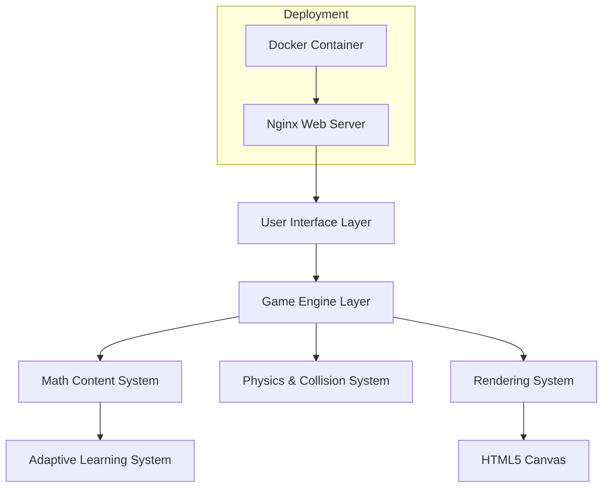
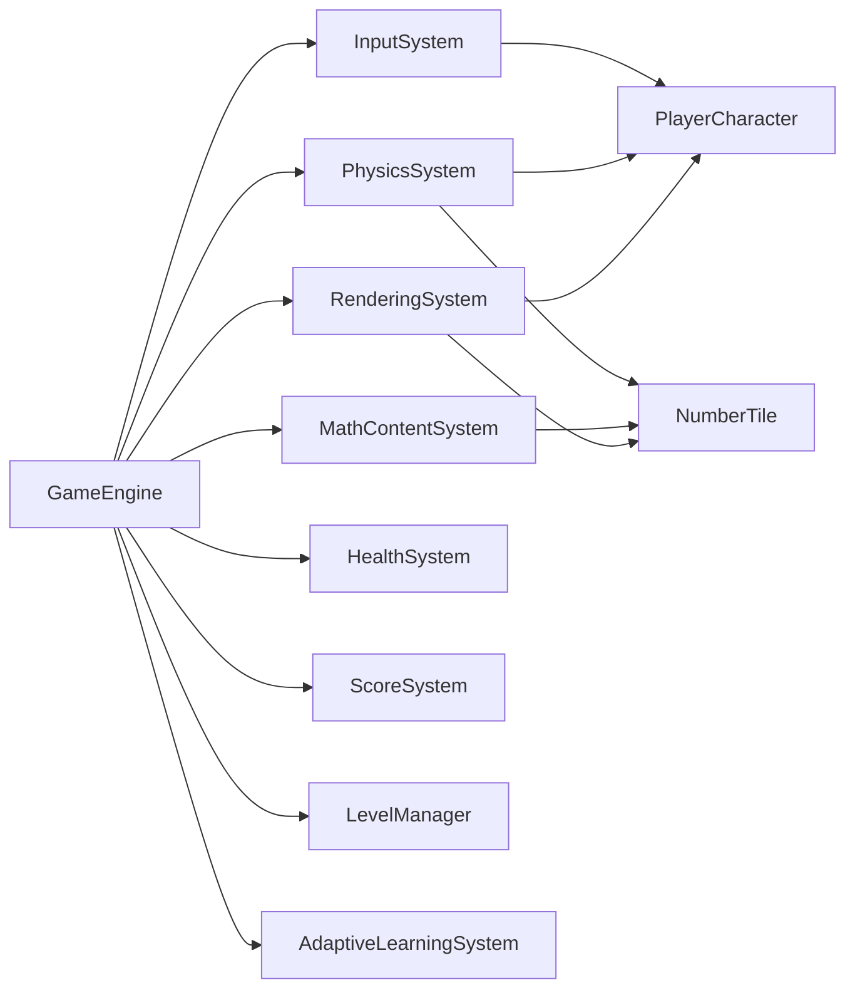
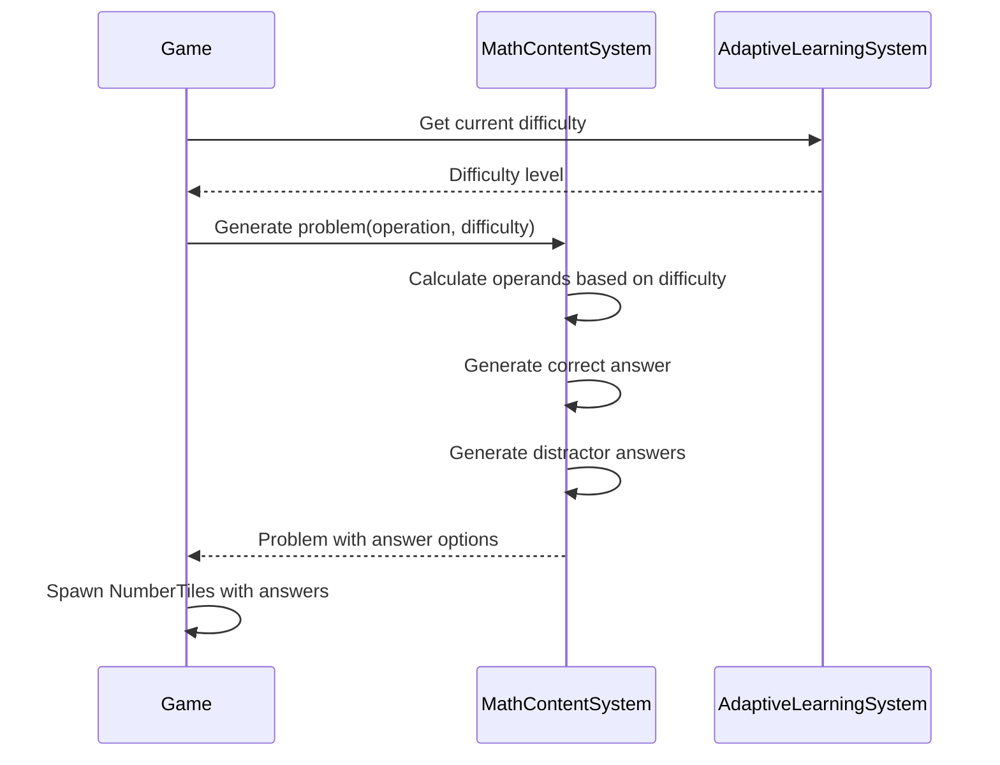
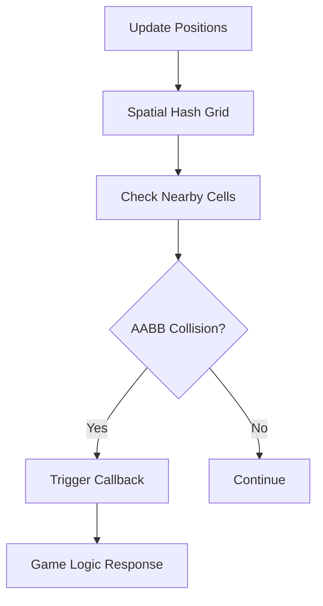
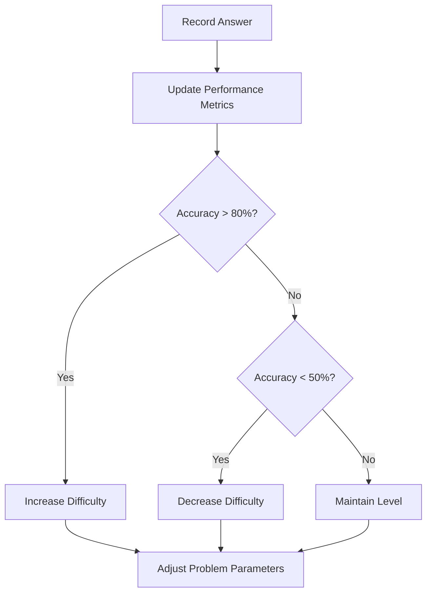
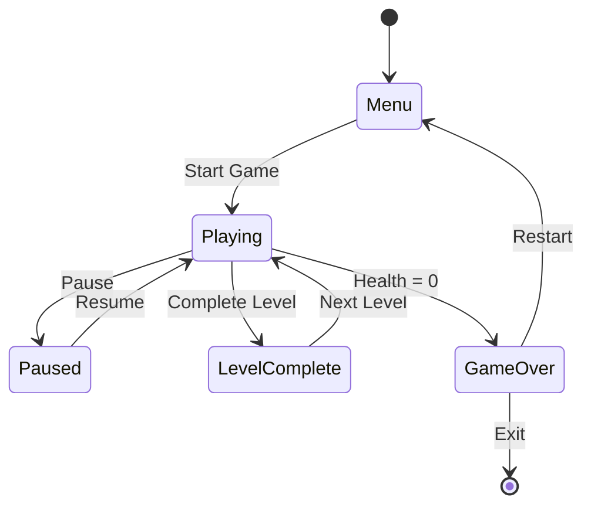

# Quick Math Game

A browser-based educational game that helps students improve their arithmetic skills through fast-paced, interactive gameplay. Players control a character that moves around the screen to collide with correct answers to math problems.

## 🎮 Game Overview

Quick Math combines arcade-style mechanics with educational content, creating an engaging learning experience through movement and immediate feedback. The game features:

- **Four Math Operations**: Addition, subtraction, multiplication, and division
- **Adaptive Difficulty**: Automatically adjusts based on player performance
- **Progressive Levels**: Increasing challenge with faster tiles and mixed operations
- **Visual Feedback**: Immediate response to correct and incorrect answers
- **Health System**: Life bar that decreases with mistakes
- **Responsive Design**: Works on desktop and tablet devices

## 🏗️ Architecture

### High-Level System Architecture



### Component Architecture

The game follows a modular, component-based architecture with clear separation of concerns:



## 📁 Project Structure

```
quick-math-game/
├── js/
│   ├── core/
│   │   ├── Entity.js              # Base entity class
│   │   └── GameEngine.js          # Main game loop and orchestration
│   ├── entities/
│   │   ├── NumberTile.js          # Moving answer tiles
│   │   └── PlayerCharacter.js     # Player-controlled character
│   ├── systems/
│   │   ├── AdaptiveLearningSystem.js    # Performance tracking & difficulty adjustment
│   │   ├── CollisionFeedbackSystem.js   # Visual feedback for collisions
│   │   ├── GameLogicSystem.js           # Core game rules
│   │   ├── GameStateManager.js          # State machine (menu, playing, game over)
│   │   ├── HealthSystem.js              # Health bar management
│   │   ├── InputSystem.js               # Keyboard and touch input
│   │   ├── LevelManager.js              # Level progression
│   │   ├── MathContentSystem.js         # Problem generation
│   │   ├── NumberTileSystem.js          # Tile spawning and management
│   │   ├── PhysicsSystem.js             # Collision detection
│   │   ├── QuestionDisplaySystem.js     # Question UI
│   │   ├── ResponsiveSystem.js          # Responsive scaling
│   │   └── ScoreSystem.js               # Score tracking
│   ├── utils/
│   │   └── Vector2D.js            # 2D vector math
│   └── main.js                    # Entry point
├── test/
│   ├── *.property.test.js         # Property-based tests
│   ├── *.test.js                  # Unit tests
│   └── setup.js                   # Test configuration
├── index.html                     # Main game page
├── Dockerfile                     # Docker configuration
├── docker-compose.yml             # Docker Compose setup
└── package.json                   # Dependencies and scripts
```

## 🎯 Core Systems

### 1. Game Engine

The central orchestrator managing the game loop, state transitions, and system coordination.

**Key Responsibilities:**
- 60 FPS game loop (update/render cycle)
- System registration and coordination
- State management (menu, playing, paused, game over)
- Configuration management

### 2. Math Content System

Generates mathematical problems with appropriate difficulty scaling.

**Features:**
- Supports all four basic operations
- Configurable difficulty ranges
- Generates plausible distractor answers
- Tracks operation-specific performance

**Problem Generation Flow:**



### 3. Physics System

Handles movement and collision detection using spatial hashing for performance.

**Collision Detection:**
- Axis-Aligned Bounding Box (AABB) algorithm
- Spatial hash grid for efficient queries
- Collision response callbacks



### 4. Adaptive Learning System

Analyzes player performance and adjusts difficulty dynamically.

**Tracking Metrics:**
- Accuracy per operation type
- Response times
- Recent performance trends
- Difficulty progression

**Adaptation Algorithm:**



### 5. Input System

Unified input handling for keyboard and touch controls.

**Supported Inputs:**
- Keyboard: Arrow keys, WASD
- Touch: Drag controls for mobile
- Normalized into movement commands

### 6. Rendering System

Optimized canvas rendering with dirty rectangle optimization.

**Rendering Pipeline:**
1. Clear canvas (or dirty rectangles)
2. Render background elements
3. Render game entities (tiles, player)
4. Render UI elements (score, health, question)
5. Render visual effects (particles, feedback)

## 🚀 Getting Started

### Prerequisites

- Node.js (v14 or higher)
- Docker and Docker Compose (for containerized deployment)
- Modern web browser (Chrome, Firefox, Safari, Edge)

### Installation

1. **Clone the repository:**
```bash
git clone <repository-url>
cd quick-math-game
```

2. **Install dependencies:**
```bash
npm install
```

### Running the Game

#### Option 1: Direct Browser Access

Simply open `index.html` in your web browser:

```bash
open index.html  # macOS
# or
start index.html  # Windows
# or
xdg-open index.html  # Linux
```

#### Option 2: Docker Deployment

Run the game in a Docker container with nginx:

```bash
docker compose up --build
```

Then access the game at: `http://localhost:8080`

### Running Tests

The project includes comprehensive test coverage with both unit tests and property-based tests.

**Run all tests:**
```bash
npm test
```

**Run tests in watch mode:**
```bash
npm run test:watch
```

**Run specific test file:**
```bash
npm test -- test/physicsSystem.test.js
```

## 🎮 How to Play

1. **Start the Game**: Click "Start Game" on the menu screen
2. **Read the Question**: A math problem appears at the top of the screen
3. **Move Your Character**: Use arrow keys or WASD to move
   - On touch devices: Drag to move
4. **Collect the Correct Answer**: Move your character to collide with the number tile showing the correct answer
5. **Avoid Wrong Answers**: Colliding with incorrect answers decreases your health
6. **Progress Through Levels**: Complete questions to advance and face increasing difficulty
7. **Game Over**: When health reaches zero, view your final score and performance

## 🧪 Testing Strategy

The game uses a dual testing approach for comprehensive coverage:

### Unit Tests
- Specific examples and edge cases
- Component integration points
- Error conditions and recovery

### Property-Based Tests
- Universal properties across all inputs
- 100+ iterations per test
- Validates correctness properties from design

**Testing Framework:** Jest + fast-check

**Key Property Tests:**
- **Property 1**: Number tile movement diversity
- **Property 3**: Collision detection accuracy
- **Property 10**: Math problem generation scaling
- **Property 12**: Animation smoothness
- **Property 14**: Adaptive difficulty adjustment

## 📊 Game Flow



## 🔧 Configuration

Game configuration can be adjusted in `js/main.js`:

```javascript
const config = {
    canvas: {
        width: 800,
        height: 600
    },
    player: {
        speed: 200,
        size: 40
    },
    difficulty: {
        startLevel: 1,
        maxLevel: 10
    },
    health: {
        initial: 5,
        max: 10
    }
};
```

## 🎨 Visual Design

The game features a colorful, arcade-inspired design:

- **Color Scheme**: Bright, engaging colors suitable for educational content
- **Typography**: Clear, readable fonts for children and teens
- **Animations**: Smooth transitions and particle effects
- **Feedback**: Immediate visual response to player actions

## 📈 Performance Optimization

- **Spatial Hashing**: Efficient collision detection with O(1) average case
- **Object Pooling**: Reuse frequently created/destroyed objects
- **Dirty Rectangle Rendering**: Only redraw changed areas
- **RequestAnimationFrame**: Smooth 60 FPS game loop

## 🐛 Troubleshooting

### Game doesn't start
- Check browser console for errors
- Ensure JavaScript is enabled
- Try a different browser

### Poor performance
- Close other browser tabs
- Reduce browser zoom level
- Check system resources

### Docker issues
- Ensure Docker is running
- Check port 8080 is not in use
- Try `docker compose down` then `docker compose up --build`

## 📝 Development

### Adding New Math Operations

1. Update `MathContentSystem.js` with new operation logic
2. Add difficulty scaling parameters
3. Update tests in `test/mathContentSystem.test.js`
4. Add property tests for the new operation

### Adding New Movement Patterns

1. Add pattern to `NumberTile.js` movement patterns
2. Implement pattern logic in `updateMovement()`
3. Test with property tests for movement diversity

## 🤝 Contributing

Contributions are welcome! Please follow these steps:

1. Fork the repository
2. Create a feature branch
3. Make your changes
4. Add tests for new functionality
5. Ensure all tests pass
6. Submit a pull request

## 📄 License

[Add your license information here]

## 🙏 Acknowledgments

- Built with HTML5 Canvas and vanilla JavaScript
- Testing with Jest and fast-check
- Containerized with Docker and nginx

## 📞 Support

For issues, questions, or suggestions, please open an issue on the repository.

---

**Happy Learning! 🎓🎮**
